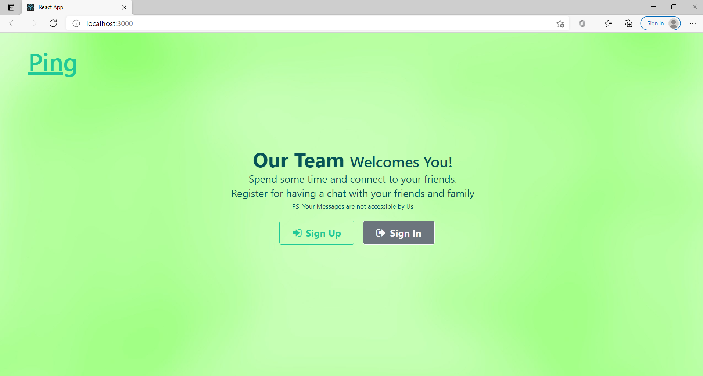
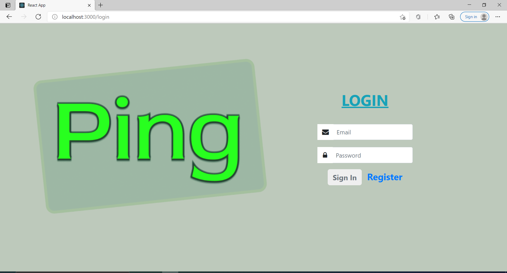
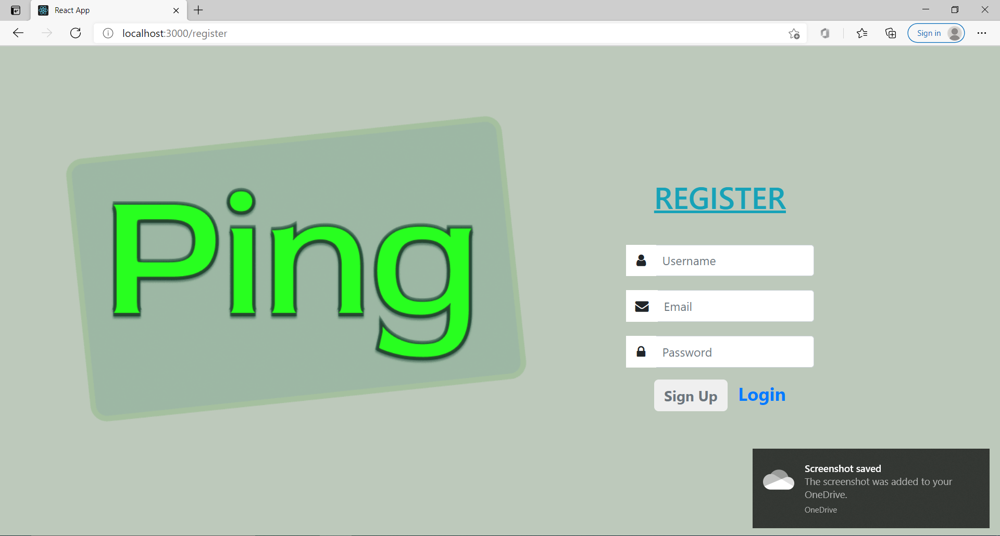
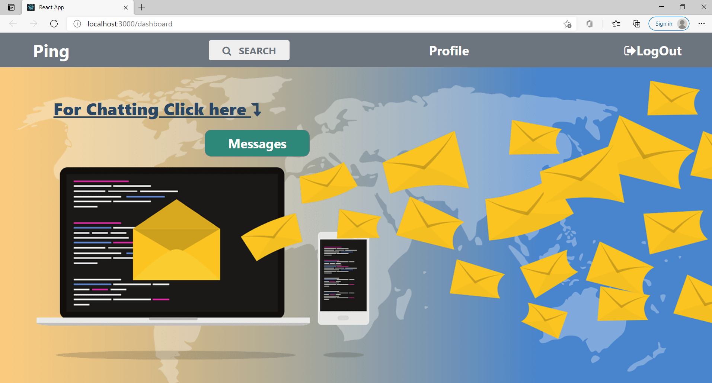
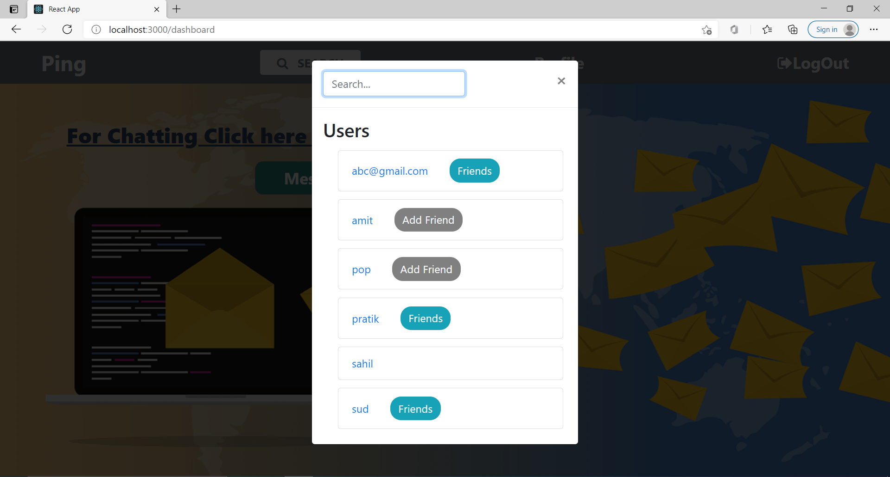
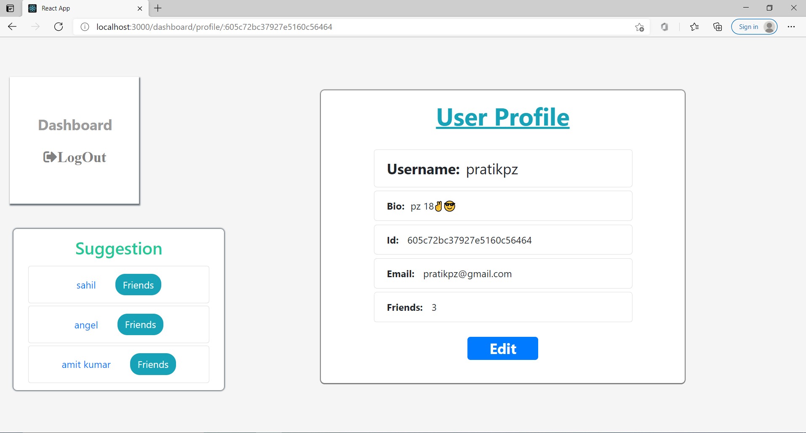
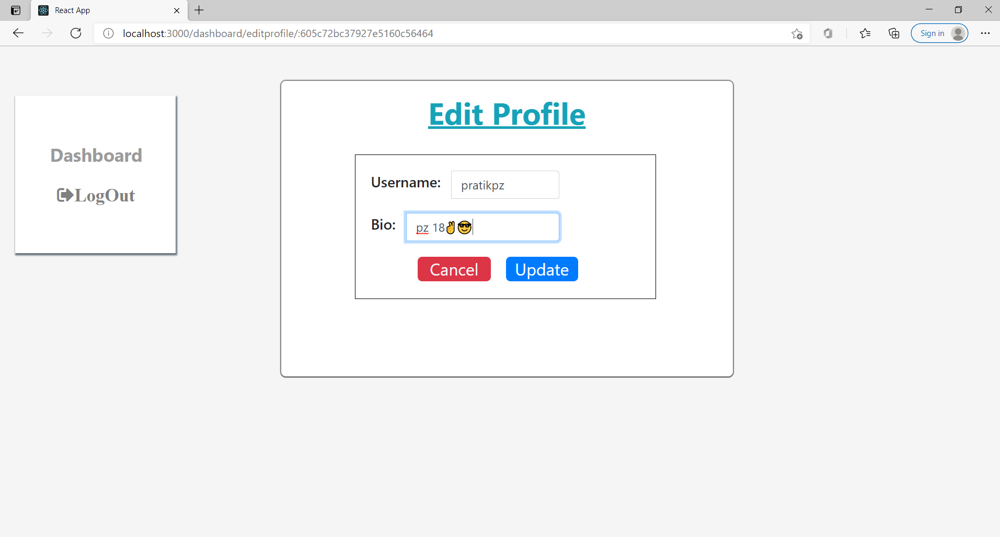
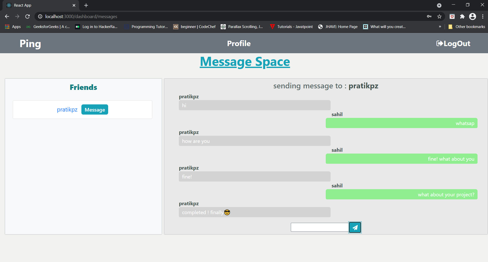
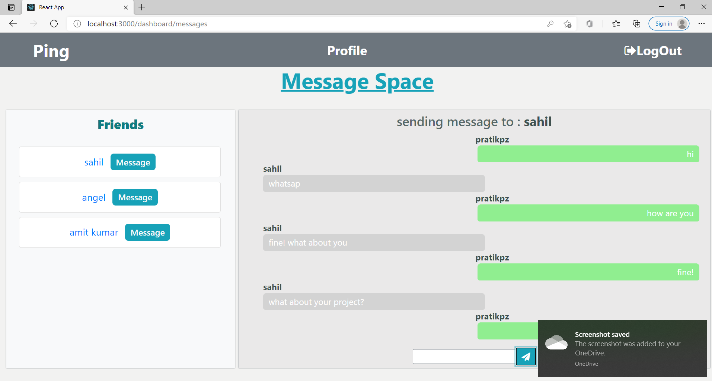

# <h1 align="center"><b>Ping</b></h1>
<p align="center">A chatting website where user can connect with other users and chat with them
    <br> 
</p>

## Instruction :-
##### To run this 
#### npm install 
##### then go to backend folder dir 
### npm run dev
##### now visit http://localhost:3000/


## ⛏️ Built Using <a name = "tech_stack"></a>
 #### MERN
- [MongoDB](https://https://www.mysql.com/) - NoSQL Database
- [Express](https://expressjs.com/) - Backend NodeJs Framework
- [ReactJS](https://reactjs.org/)-Frontend Javascript Library
- [NodeJs](https://nodejs.org/en/) - Server Environment
- [Socket.io](https://socket.io/)-Framework for real-time, bidirectional and event-based communication.
- [BootStrap 4](https://getbootstrap.com/) - Frontend CSS Library

## Screenshots <a name = "Screenshots"></a>

-Landing

- Login

- Signup

- Dashboard

- SearchModal

- Profile

- EditProfile 

- Messages 1

- Messages 2


## Installing
- [NodeJS](https://nodejs.org/en/) - Install NodeJS

      dependecies
          "bcryptjs": "^2.4.3",
          "body-parser": "^1.19.0",
          "concurrently": "^5.3.0",
          "cors": "^2.8.5",
          "express": "^4.17.1",
          "express-session": "^1.17.1",
          "express-validator": "^6.9.2",
          "http": "0.0.1-security",
          "jsonwebtoken": "^8.5.1",
          "mongoose": "^5.11.12",
          "socket.io": "^3.1.1"
          
 ## Features:

    => Registration and Login 
       ---
        • User need to register themselves and then they can login into the system. 
        • Once user is logged in,user can use different features.

    => Messages section:   
       ---
       • Messages are send to cliend and recieved realtime.

    => Profile Section: 
       ---
        • Users information like username,bio,email,id,Friends Count.
    
    => Add Friends:
       ---
        • User can add friend. If user is friend of other user, then that user is displayed in Messages SECTION.

    => Search Bar: 
       ---
       • User can search for other users. 

    => Edit Profile :
       ---
       • User can change his/her username and update his/her bio.
   
 ## Functionality
 ---
    ❖ Registration
    ❖ Login
    ❖ Update your profile details 
    ❖ Send Messages
    ❖ Visit Other Users Profile
    ❖ Shows count of Friends
    ❖ You can search a particular user
    ❖ Suggestion for Adding Friends
    ❖ If not logged in redirected to login page
    ❖ Messages vanishes when users disconnects.
    ❖ User data after login is saved to localstorage when he/she logouts localstorage is removed
 
## Folder Structure
```
ping
│
├──backend
│   ├── config
│   ├── controllers
│   ├── middlewares
│   ├── models
│   ├── node_modules
│   ├── routes
│   ├── .gitignore
│   ├── node_modules
│   ├── package.json
│   ├── README.md
├──frontend
│   ├── README.md
│   ├── node_modules
│   ├── package.json
│   ├── .gitignore
│   ├── public
│   │   ├── favicon.ico
│   │   ├── index.html
│   │   ├── logo512.png
│   │   └── manifest.json
│   └── src
│       ├── components
│       ├── elements
│       ├── img
│       ├── services
│       ├── App.css
│       ├── App.js
│       ├── App.test.js
│       ├── index.css
│       ├── index.js
│       └── reportWebVitals.js
│       └── setupTests.js
└── README.MD
```
    
 ## ✍️ Author <a name = "authors"></a>
- [@Pratik Zinjurde](https://github.com/pratikpz18) -  Ping

## Acknowledgments <a name = "acknowledgments"></a>
- References
- [Instagram](https://www.instagram.com/?hl=en)
- [LinkedIn](https://www.linkedin.com/in/pratik-zinjurde-2a10b71b1/)
- [Twitter](https://www.twitter.com)
    
        


